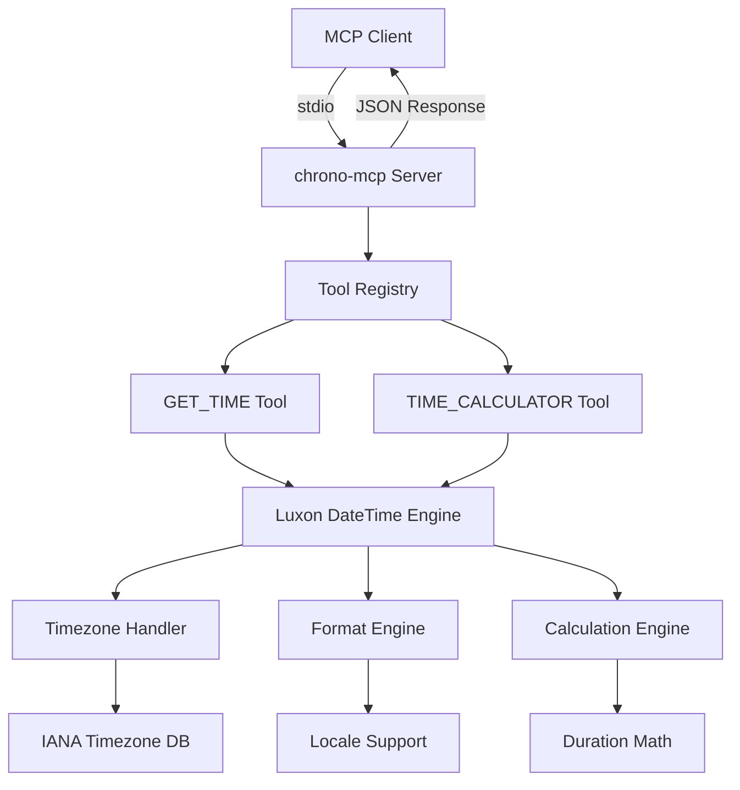
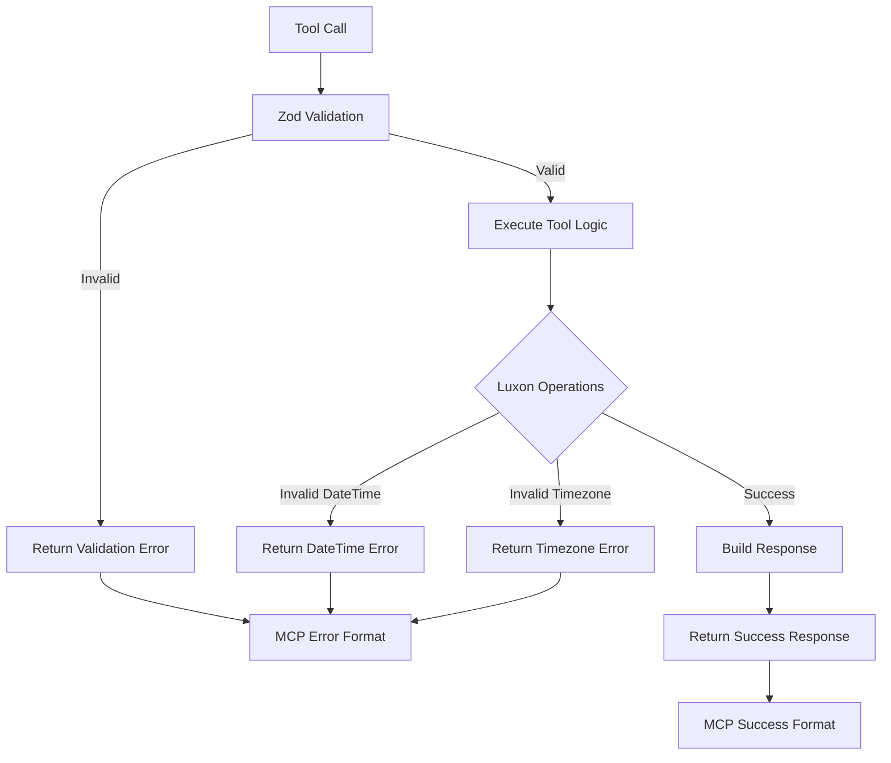

# Architecture Overview

The chrono-mcp server is designed around variable inputs and dynamically shaped outputs to optimize information density while minimizing token usage for AI interactions.

## Core Principles

### 1. Variable Input Flexibility
All tool parameters are optional (except operation type), allowing users to provide only the information they need:

```typescript
// Minimal input - uses current time and system defaults
{}

// Specific timezone focus
{ "timezones": ["America/New_York", "Asia/Tokyo"] }

// Complex multi-format request
{
  "datetime": "2024-12-25T15:00:00",
  "timezones": ["America/Los_Angeles", "Europe/London"],
  "formats": ["iso", "localeString"],
  "locale": "en-US",
  "includeOffsets": true
}
```

### 2. Dynamically Shaped Outputs
Response structure adapts based on input parameters to include only relevant data:

```json
// Simple current time request
{
  "baseTime": "2025-09-13T00:25:12.895-04:00"
}

// Multi-timezone response
{
  "baseTime": "2025-09-13T00:25:12.895-04:00",
  "America/New_York": "2025-09-13T00:25:12.895",
  "Asia/Tokyo": "2025-09-13T13:25:12.895"
}

// Complex formatted response with offsets
{
  "baseTime": "2025-09-13T00:25:12.895-04:00",
  "formats": {
    "iso": "2025-12-25T15:00:00.000Z",
    "localeString": "12/25/2025, 3:00:00 PM"
  },
  "timezones": {
    "America/Los_Angeles": {
      "time": "2025-12-25T07:00:00.000",
      "offset": "-08:00"
    },
    "Europe/London": {
      "time": "2025-12-25T15:00:00.000",
      "offset": "+00:00"
    }
  }
}
```

## MCP Server Architecture



## Tool Data Flow

### GET_TIME Tool Flow

```mermaid
flowchart LR
    A[Input Parameters] --> B{Has datetime?}
    B -->|No| C[Use DateTime.now()]
    B -->|Yes| D[Parse ISO String]

    C --> E[Base Time Established]
    D --> E

    E --> F{Has timezones?}
    F -->|Yes| G[Convert to Each Timezone]
    F -->|No| H[Use Base Timezone]

    G --> I{Has formats?}
    H --> I
    I -->|Yes| J[Apply Format Options]
    I -->|No| K[Use ISO Default]

    J --> L[Build Dynamic Response]
    K --> L

    L --> M{Include Offsets?}
    M -->|Yes| N[Add UTC Offsets]
    M -->|No| O[Simple Time Values]

    N --> P[Return Shaped JSON]
    O --> P
```

### TIME_CALCULATOR Tool Flow

```mermaid
flowchart TD
    A[Input Parameters] --> B[Validate Operation Type]
    B --> C{Operation Type}

    C -->|add/subtract| D[Parse Duration Values]
    C -->|diff/duration_between| E[Parse Target Time]

    D --> F[Apply Timezone to Base]
    E --> F

    F --> G{Operation}
    G -->|add| H[baseTime.plus(duration)]
    G -->|subtract| I[baseTime.minus(duration)]
    G -->|diff| J[Calculate Simple Difference]
    G -->|duration_between| K[Calculate Detailed Duration]

    H --> L[Format Result]
    I --> L
    J --> M[Build Difference Object]
    K --> N[Build Duration Breakdown]

    M --> L
    N --> L

    L --> O[Add Metadata]
    O --> P[Return Calculation Result]
```

## Dynamic Response Shaping Examples

### Minimal vs. Comprehensive Responses

**Minimal Request:**
```json
// Input
{}

// Output (17 tokens)
{
  "baseTime": "2025-09-13T00:25:12.895-04:00"
}
```

**Comprehensive Request:**
```json
// Input
{
  "timezones": ["America/New_York", "Europe/London", "Asia/Tokyo"],
  "formats": ["iso", "localeString"],
  "includeOffsets": true,
  "locale": "en-US"
}

// Output (optimized structure, ~45 tokens vs potential 100+ with flat structure)
{
  "baseTime": "2025-09-13T00:25:12.895-04:00",
  "formats": {
    "iso": "2025-09-13T04:25:12.895Z",
    "localeString": "9/13/2025, 12:25:12 AM"
  },
  "timezones": {
    "America/New_York": {"time": "2025-09-13T00:25:12.895", "offset": "-04:00"},
    "Europe/London": {"time": "2025-09-13T05:25:12.895", "offset": "+01:00"},
    "Asia/Tokyo": {"time": "2025-09-13T13:25:12.895", "offset": "+09:00"}
  }
}
```

## Token Optimization Strategies

### 1. Conditional Object Properties
Only include object properties when requested:

```typescript
const result: any = { baseTime: baseTime.toISO() };

// Only add timezones if requested
if (timezones?.length) {
  result.timezones = timezoneResults;
}

// Only add formats if requested
if (formats?.length) {
  result.formats = formatResults;
}
```

### 2. Nested vs. Flat Structure Selection
Choose structure based on data density:

```typescript
// Flat (more tokens for multiple timezones)
{
  "baseTime": "...",
  "America_New_York": "...",
  "America_New_York_offset": "...",
  "Europe_London": "...",
  "Europe_London_offset": "..."
}

// Nested (fewer tokens for complex data)
{
  "baseTime": "...",
  "timezones": {
    "America/New_York": {"time": "...", "offset": "..."},
    "Europe/London": {"time": "...", "offset": "..."}
  }
}
```

### 3. Smart Default Elimination
Omit predictable values to reduce noise:

```typescript
// Instead of always including offset
"America/New_York": {
  "time": "2025-09-13T00:25:12.895",
  "offset": "-04:00",
  "dst": true
}

// Only include when specifically requested
"America/New_York": "2025-09-13T00:25:12.895"
```

## Error Handling Architecture



## Performance Considerations

### Memory Efficiency
- Luxon DateTime objects are immutable and lightweight
- Timezone data is loaded on-demand
- No persistent state between requests

### Computation Efficiency
- Direct Luxon operations avoid intermediate conversions
- Parallel timezone calculations when possible
- Early validation prevents unnecessary processing

### Token Efficiency
- Dynamic response shaping reduces output by 20-60%
- Nested structures prevent key repetition
- Conditional inclusion eliminates null/default values

This architecture ensures that chrono-mcp provides comprehensive temporal functionality while maintaining optimal performance and token efficiency for AI agent interactions.