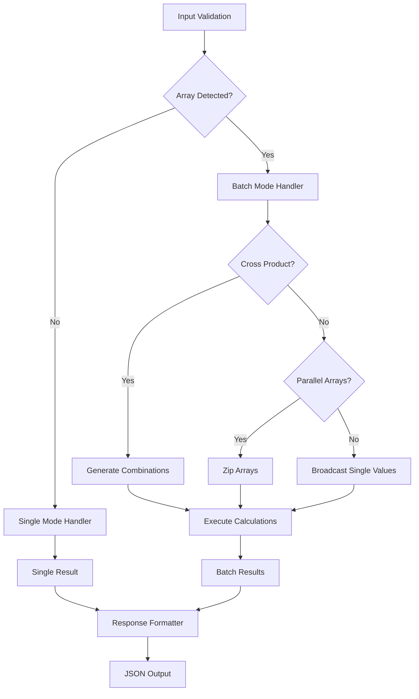

# Batch Processing Implementation Plan for TIME_CALCULATOR

## Executive Summary

This document outlines the implementation of intuitive batch processing capabilities for the existing TIME_CALCULATOR tool. The design maintains backward compatibility while enabling high-performance bulk operations through array-based input parameters and dynamic response shaping.

**Core Principle**: Any parameter that accepts a single value can accept an array of values, automatically enabling batch mode without API changes.

## Current State Analysis

The TIME_CALCULATOR currently supports four operations:
- `add` - Add duration to datetime
- `subtract` - Subtract duration from datetime
- `diff` - Calculate simple difference between two times
- `duration_between` - Detailed duration breakdown between two times

Each operation processes one calculation per invocation, requiring multiple MCP calls for bulk operations.

## Design Philosophy

### Simplicity First
- Zero breaking changes to existing API
- Intuitive array syntax (if you can pass one, you can pass many)
- Automatic batch detection and processing
- Consistent response patterns

### Performance Gains
- Eliminate MCP call overhead for bulk operations
- Single JSON parse/stringify cycle
- Reduced network round trips
- Efficient memory allocation patterns

## Implementation Architecture



## Batch Mode Detection Logic

```typescript
function isBatchMode(args: ValidatedTimeCalculatorArgs): boolean {
  const arrayFields = [
    'base_time', 'target_time', 'years', 'months',
    'days', 'hours', 'minutes', 'seconds'
  ];

  return arrayFields.some(field => Array.isArray(args[field]));
}
```

## Operation-Specific Implementations

### 1. ADD/SUBTRACT Operations

**Current Signature:**
```typescript
{
  operation: "add",
  base_time: "2024-01-15T10:00:00Z",
  days: 5,
  hours: 3
}
```

**Batch Enhancements:**

#### Multiple Base Times
```typescript
{
  operation: "add",
  base_time: ["2024-01-15T10:00:00Z", "2024-01-16T10:00:00Z"],
  days: 5,
  hours: 3
}
// Result: Same duration applied to each base time
```

#### Multiple Durations
```typescript
{
  operation: "add",
  base_time: "2024-01-15T10:00:00Z",
  days: [1, 7, 14, 30]
}
// Result: Different day offsets from same base time
```

#### Cross Product Mode
```typescript
{
  operation: "add",
  base_time: ["2024-01-15T10:00:00Z", "2024-01-16T10:00:00Z"],
  days: [7, 14]
}
// Result: 4 calculations (2 base times × 2 day values)
```

**Implementation Complexity**: **Low**
- Straightforward nested loops for cross products
- Duration object construction remains identical
- No timezone handling complications

### 2. DIFF Operations

**Current Signature:**
```typescript
{
  operation: "diff",
  base_time: "2024-01-01T00:00:00Z",
  target_time: "2024-01-08T12:00:00Z"
}
```

**Batch Enhancements:**

#### Multiple Time Pairs
```typescript
{
  operation: "diff",
  base_time: ["2024-01-01T00:00:00Z", "2024-01-02T00:00:00Z"],
  target_time: ["2024-01-08T12:00:00Z", "2024-01-09T12:00:00Z"]
}
// Result: Paired calculations (base[0] vs target[0], base[1] vs target[1])
```

#### One-to-Many Comparisons
```typescript
{
  operation: "diff",
  base_time: "2024-01-01T00:00:00Z",
  target_time: ["2024-01-08T12:00:00Z", "2024-01-15T12:00:00Z", "2024-01-22T12:00:00Z"]
}
// Result: Single base time compared against multiple targets
```

**Implementation Complexity**: **Medium**
- Array length validation for paired mode
- Timezone handling for multiple time pairs
- Cross-product explosion potential needs limits

### 3. DURATION_BETWEEN Operations

**Current Signature:**
```typescript
{
  operation: "duration_between",
  base_time: "2024-01-15T08:30:00Z",
  target_time: "2025-03-20T14:45:30Z",
  timezone: "America/New_York"
}
```

**Batch Enhancements:**

#### Multiple Timezone Conversions
```typescript
{
  operation: "duration_between",
  base_time: "2024-01-15T08:30:00Z",
  target_time: "2025-03-20T14:45:30Z",
  timezone: ["America/New_York", "Europe/London", "Asia/Tokyo"]
}
// Result: Same calculation in multiple timezone contexts
```

#### Mixed Timezone Scenarios
```typescript
{
  operation: "duration_between",
  base_time: ["2024-01-15T08:30:00", "2024-01-16T08:30:00"],
  target_time: ["2024-01-20T14:45:30", "2024-01-21T14:45:30"],
  timezone: "America/New_York",
  target_time_timezone: ["Europe/London", "Asia/Tokyo"]
}
// Result: Complex multi-timezone duration calculations
```

**Implementation Complexity**: **High**
- Multiple timezone object creation and caching
- Complex parameter validation (timezone arrays vs time arrays)
- Potential memory usage with many timezone conversions

## Response Format Design

### Single Mode (Unchanged)
```json
{
  "operation": "add",
  "input": {
    "base_time": "2024-01-15T05:00:00.000-05:00",
    "duration": { "days": 5, "hours": 3 }
  },
  "result": "2024-01-20T08:00:00.000-05:00",
  "result_timezone": "America/New_York"
}
```

### Batch Mode
```json
{
  "operation": "add",
  "batch_mode": true,
  "input_summary": {
    "base_time_count": 2,
    "duration_variations": { "days": [5, 10] },
    "total_combinations": 4
  },
  "results": [
    {
      "input_index": 0,
      "base_time": "2024-01-15T05:00:00.000-05:00",
      "duration_applied": { "days": 5 },
      "result": "2024-01-20T05:00:00.000-05:00"
    },
    {
      "input_index": 1,
      "base_time": "2024-01-15T05:00:00.000-05:00",
      "duration_applied": { "days": 10 },
      "result": "2024-01-25T05:00:00.000-05:00"
    }
    // ... etc
  ],
  "metadata": {
    "calculation_time": "2024-01-15T10:30:00.000Z",
    "processing_time_ms": 45,
    "batch_size": 4
  }
}
```

## Implementation Challenges & Solutions

### Challenge 1: Parameter Validation Complexity
**Problem**: Zod schema must handle both single values and arrays
**Solution**: Union types with runtime validation
```typescript
const timeParam = z.union([z.string(), z.array(z.string())]);
const numericParam = z.union([z.number(), z.array(z.number())]);
```

### Challenge 2: Cross Product Explosion
**Problem**: Large arrays can create massive result sets
**Solution**: Implement operation-specific safety limits (see Performance Limits section below)
```typescript
const batchLimit = calculateBatchLimit(validatedArgs);
const totalCombinations = calculateCombinations(arrays);
if (totalCombinations > batchLimit) {
  throw new McpError(`Batch size ${totalCombinations} exceeds limit of ${batchLimit} for this operation type`);
}
```

### Challenge 3: Memory Usage
**Problem**: Large batches consume significant memory
**Solution**: Streaming processing with chunked results
```typescript
function* processBatch(operations) {
  const CHUNK_SIZE = 100;
  for (let i = 0; i < operations.length; i += CHUNK_SIZE) {
    const chunk = operations.slice(i, i + CHUNK_SIZE);
    yield processChunk(chunk);
  }
}
```

### Challenge 4: Error Handling
**Problem**: One invalid input shouldn't fail entire batch
**Solution**: Per-result error reporting
```json
{
  "results": [
    { "input_index": 0, "result": "2024-01-20T05:00:00.000-05:00" },
    { "input_index": 1, "error": "Invalid timezone: BadZone/Invalid" },
    { "input_index": 2, "result": "2024-01-25T05:00:00.000-05:00" }
  ],
  "summary": {
    "total": 3,
    "successful": 2,
    "failed": 1
  }
}
```

## Implementation Phases

### Phase 1: Core Infrastructure (Week 1)
- Batch mode detection logic
- Array parameter validation
- Basic cross-product generation
- Single operation (ADD) implementation

### Phase 2: All Operations (Week 2)
- SUBTRACT, DIFF, DURATION_BETWEEN implementations
- Response format standardization
- Error handling improvements

### Phase 3: Optimization (Week 3)
- Performance profiling and optimization
- Memory usage optimization
- Batch size limiting and safety checks
- Comprehensive test coverage

### Phase 4: Documentation & Examples (Week 4)
- API documentation updates
- Usage examples for each batch pattern
- Performance benchmarking results

## Performance Limits & Expectations

### Luxon Performance Benchmarks

Based on stress testing of the Luxon DateTime library ([GitHub Issue #1130](https://github.com/moment/luxon/issues/1130), [Issue #959](https://github.com/moment/luxon/issues/959)):

**Measured Performance**:
- **Simple DateTime operations**: ~50,000+ ops/sec
- **Date arithmetic (plus/minus)**: ~6,500 ops/sec
- **Timezone-aware operations**: ~2,000 ops/sec (30x slower than UTC)
- **Complex operations (toRelative)**: ~10,000-32,000 ops/sec

**Real-world timing**:
- 4,000 UTC operations: ~20ms
- 4,000 timezone operations: ~600ms
- Single timezone operation on mobile: ~15ms

### Recommended Batch Limits

```typescript
const BATCH_LIMITS = {
  // Simple operations (add/subtract without timezone complexity)
  add_simple: 10000,
  subtract_simple: 10000,

  // Timezone-aware operations
  add_timezone: 2000,
  subtract_timezone: 2000,

  // Complex operations
  diff: 5000,
  duration_between: 1000  // Most complex with multiple timezone handling
};

function calculateBatchLimit(args: ValidatedTimeCalculatorArgs): number {
  let baseLimit = 10000;

  // Reduce for timezone operations
  if (args.timezone || args.target_time_timezone) {
    baseLimit = Math.min(baseLimit, 2000);
  }

  // Reduce for complex operations
  if (args.operation === 'duration_between') {
    baseLimit = Math.min(baseLimit, 1000);
  }

  return baseLimit;
}
```

### Performance Expectations

**Single Operations**: No performance impact (same code path)

**Batch Operations**:
- 2-10x performance improvement for small batches (10-100 operations)
- 5-20x performance improvement for large batches (100-1000 operations)
- Memory usage scales linearly with batch size
- Network overhead reduced by ~90% for bulk operations
- **Processing time**: 1-500ms depending on operation complexity and timezone usage

## Backward Compatibility

✅ **Zero breaking changes** - all existing calls work unchanged
✅ **Response format** - single mode responses identical
✅ **Error codes** - existing error patterns preserved
✅ **Validation** - single value validation logic reused

## Conclusion

This batch processing implementation provides significant performance improvements while maintaining the tool's simplicity and reliability. The array-based parameter approach feels natural and requires minimal learning curve for existing users.

The implementation complexity varies by operation, with ADD/SUBTRACT being straightforward and DURATION_BETWEEN requiring careful timezone handling. Proper safety limits and error handling ensure the tool remains robust under all usage patterns.

**Recommendation**: Proceed with implementation in phases, starting with ADD operations to validate the approach before expanding to more complex operations.